# NeuralNets
Investigate Classification Performance of neural nets
# NueralNets using Numpy
## Objective
Implement and train a neural network to classify the letters using Numpy and Gradient Descent with Momentum. The network implemented
has the following structure:
    1. 3 layers - 1 input, 1 hidden with ReLU activation and 1 output with Softmax
    2. Cross Entropy Loss
## Results
### Training , Validation and Testing loss and Accuracy Curves

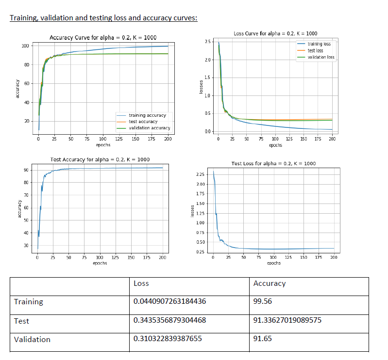

### Hyperparameter Investigation

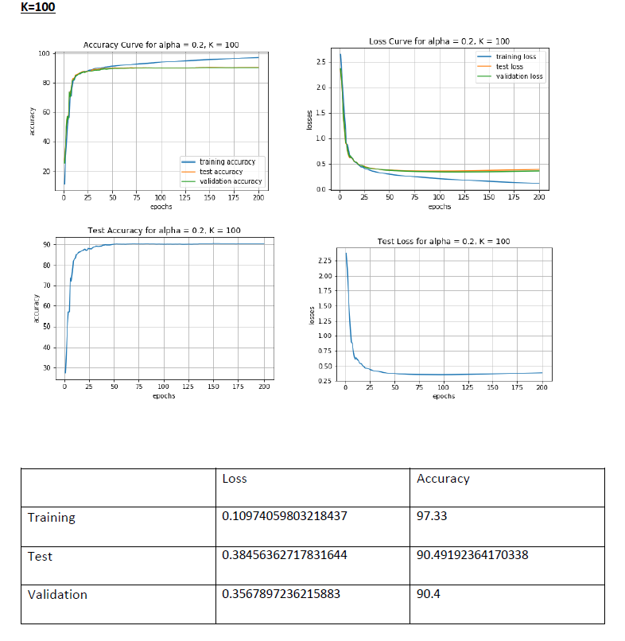

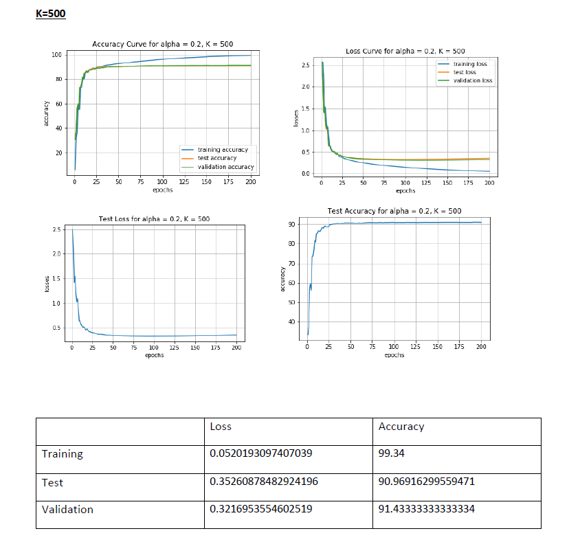

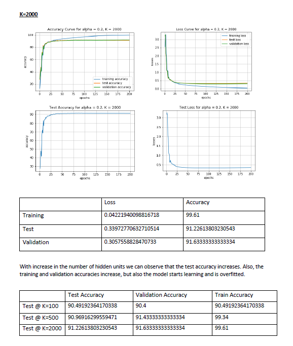

### Early Stopping

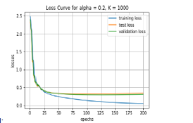

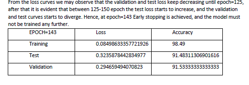

# NeuralNets using TensorFlow
## Objective
Implement and Train model using SGD for a batch size of 32, for 50 epochs and the Adam optimizer for learning rate of α = 1 x10-4, and minimize the cross-entropy loss.

### Model Traning

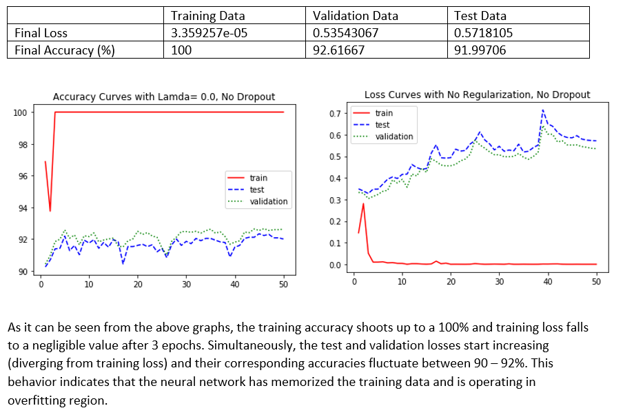

### Hyperparameter Investigation

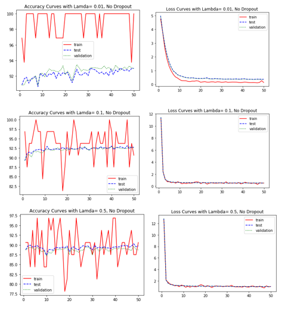

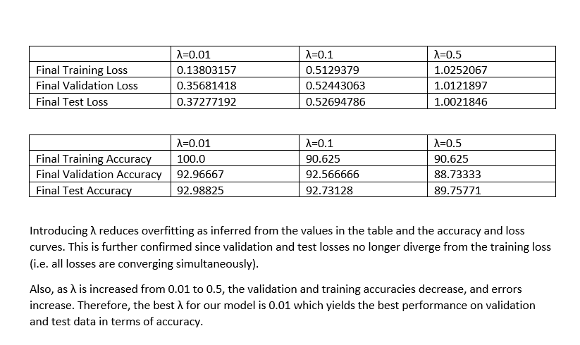

### Dropout

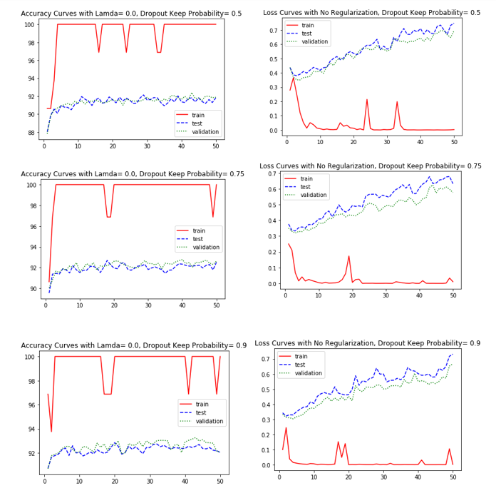

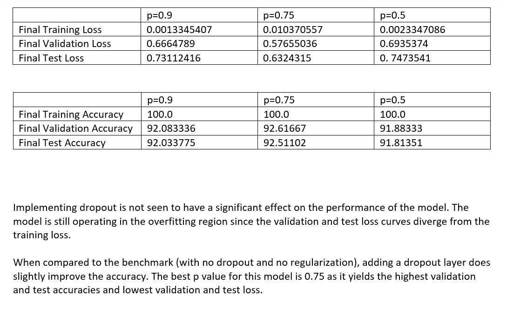

